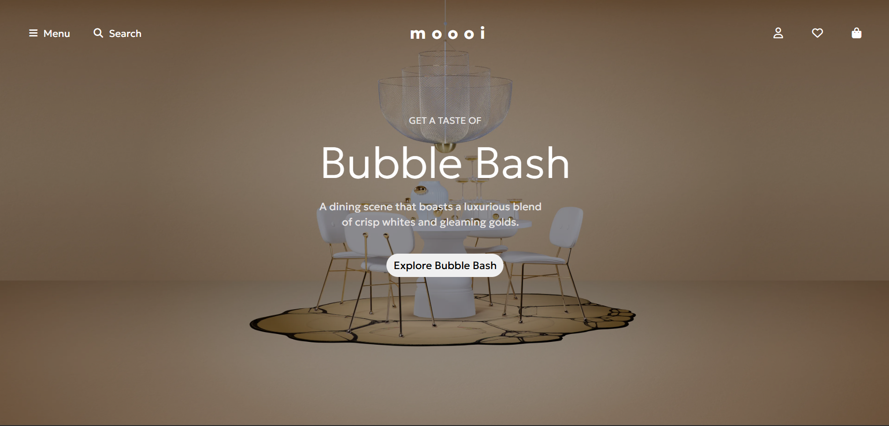

# ✨ Mobile-Only Responsive Website 🌍📲

This is a **simple responsive website** created using **HTML and CSS**.It is specially designed to work best on **mobile devices**.

## 📱 About the Project

- This project focuses on **mobile-first design**.
- The layout and styling are fully optimized for **small screen sizes**.
- It is **not responsive** for tablets or desktops.
- Kept simple and focused only on mobile.

## 🚀 Live Demo
[Click here to view the live site](https://ibrahimpatel-63.github.io/Moooi-Website/)

## 🖼️ Screenshot

## ⚙️ Technologies Used

- **HTML5**
- **CSS3**

## ⚠️ Warning

This website is **not responsive for tablets or desktops**, and is best viewed on a **mobile device**.

## 📝 Note

**This project is made for <u>educational purpose only.</u> All rights to the original Moooi content belong to their respective owners**

